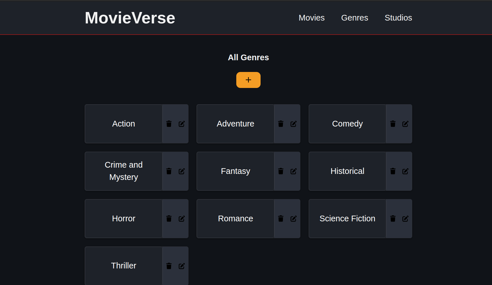
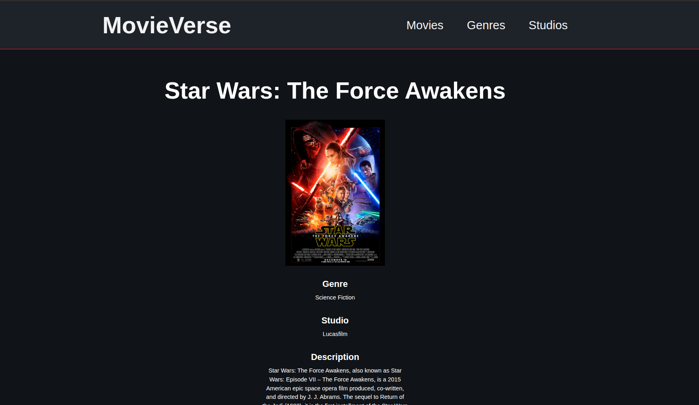

# Inventory Application

A simple inventory management web app for browsing and organizing movies, studios and genres through a clean Express-based interface.

## About This Project

This project was built as part of [The Odin Project](https://www.theodinproject.com/lessons/node-path-nodejs-inventory-application) NodeJS curriculum.

## What I Learned

Through this project, I learned how to build a server-rendered web application with Express and EJS, connect it to a PostgreSQL database, and organize routes and controllers in a maintainable way. I also deepened my understanding of form handling, validation, CRUD operations, and creating a polished user experience with reusable templates and styling.

## Technologies and Tools Used

- HTML5
- CSS3
- JavaScript (ES6+)
- Node.js
- Express
- EJS
- PostgreSQL
- pg
- dotenv
- express-validator
- Git
- GitHub

## Getting Started

1. Clone the repository
2. Install dependencies:
   - `npm install`
3. Create a PostgreSQL database and set your `DATABASE_URL` environment variable
4. Run 'create-tables.js' and (optionally) 'populate-db.js'
5. Start the development server:
   - `npm run dev`

## Live Demo

- Railway: https://inventory-application-production-abe0.up.railway.app/

## Screenshots

## Resources

### Icons

- https://fontawesome.com/icons/brands/solid/github
- https://fontawesome.com/icons/classic/solid/trash
- https://fontawesome.com/icons/classic/solid/plus
- https://fontawesome.com/icons/classic/solid/pen-to-square

### Movie Images

- https://de.wikipedia.org/wiki/Barbie_(Film)
- https://en.wikipedia.org/wiki/Titanic_(1997_film)
- https://en.wikipedia.org/wiki/Toy_Story
- https://en.wikipedia.org/wiki/Transformers_(film)
- https://en.wikipedia.org/wiki/Jurassic_Park
- https://en.wikipedia.org/wiki/Sherlock_Holmes_(2009_film)
- https://en.wikipedia.org/wiki/Frozen_2
- https://en.wikipedia.org/wiki/Oppenheimer_(film)
- https://en.wikipedia.org/wiki/Star_Wars:_The_Force_Awakens

### Studio Images

- https://en.wikipedia.org/wiki/Paramount_Pictures
- https://de.wikipedia.org/wiki/Universal_Pictures
- https://de.wikipedia.org/wiki/Warner_Bros._Entertainment
- https://de.wikipedia.org/wiki/The_Walt_Disney_Company
- https://www.deviantart.com/appleberries22/art/Lucasfilm-logo-on-screen-w-Disney-byline-894773895
- https://www.deviantart.com/sorriabkenworth/art/Pixar-Animation-Studios-Logo-Remake-893608753
- https://de.wikipedia.org/wiki/Datei:Universal_Pictures_logo.svg
